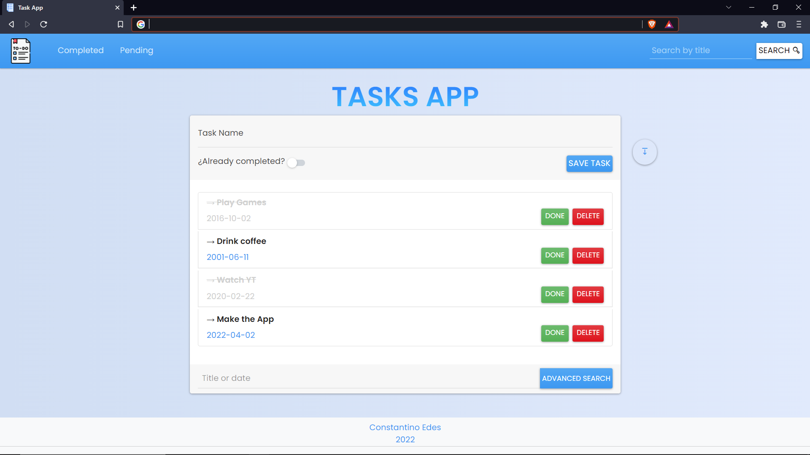

## Flask Task App 

Application to control your things to do, see which ones you have to complete and when they have been created. 

### Preview



### Installation
```
git clone https://github.com/Constan-Edes/task-app.git
cd task-app-main
python db/seeder.py 
pip install -r requeriments.txt
flask run
```

now you can visit <a href="http://localhost:8000" target="_blank" rel="noreferrer">http://localhost:8000</a>